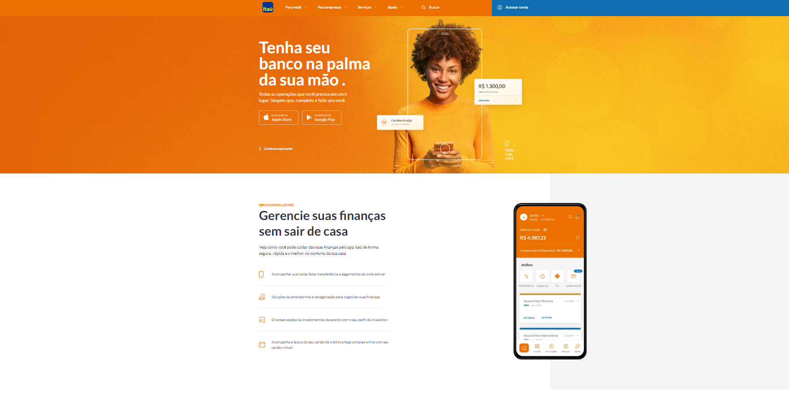

## Landing Page

## Getting Started

First, run the development server:

```bash
npm run dev
# or
yarn dev
# or
pnpm dev
# or
bun dev
```

Open [http://localhost:3000](http://localhost:3000) with your browser.

## Landing Page Exemplo Itau Enterprise




# Tools

** Using styling tailwind 
